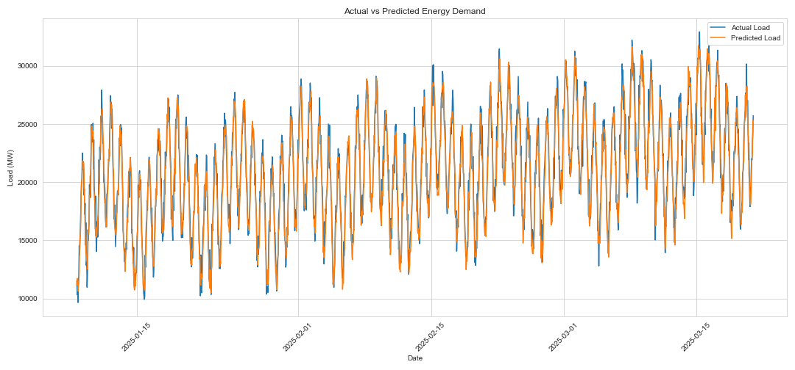
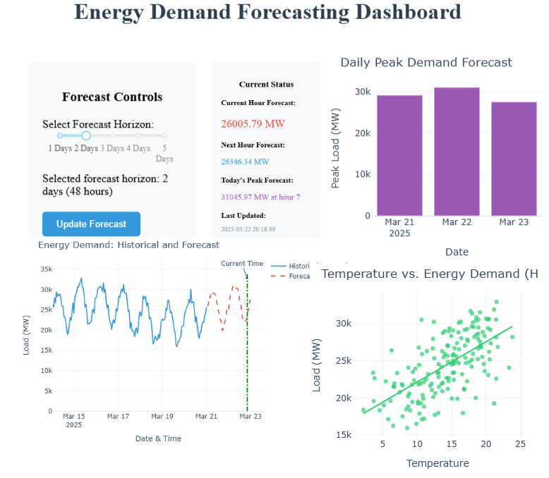
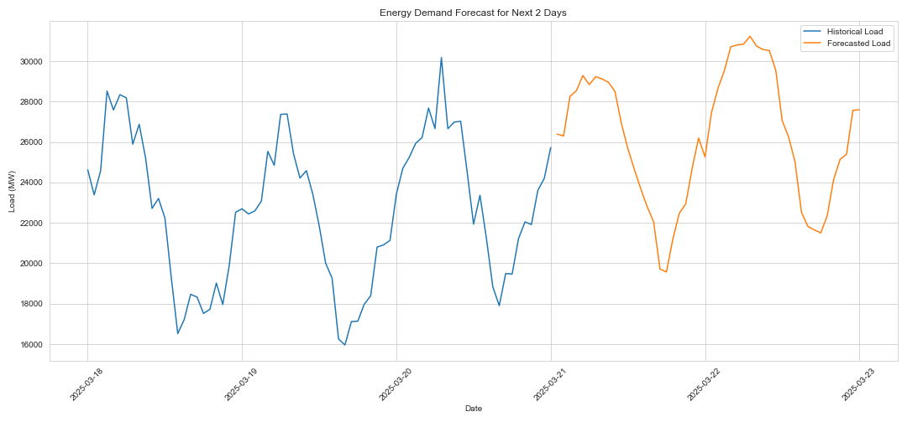

# Energy-Demand-Forecast


## Overview

An AI-driven energy demand forecasting system for smart grid optimization that uses machine learning to predict electricity consumption patterns, enabling more efficient energy distribution and integration of renewable resources.

## 🌟 Key Features

- **High-Precision Forecasting**: Predicts energy demand with hourly resolution for the next 24-48 hours
- **Weather Integration**: Incorporates temperature, humidity, and cloud cover data to improve forecast accuracy
- **Temporal Pattern Recognition**: Automatically detects and accounts for daily, weekly, and seasonal patterns
- **Real-time Interactive Dashboard**: Visualizes forecasts and enables scenario analysis
- **Scalable Architecture**: Designed to work with data from multiple regions and sources

## 🔍 Background & Motivation

Modern electricity grids face unprecedented challenges as we transition to renewable energy sources and experience increasingly unpredictable consumption patterns. Traditional forecasting methods struggle to adapt to:

- Rapid integration of intermittent renewable energy sources (solar, wind)
- Changing consumer behaviors and distributed energy resources
- Extreme weather events affecting both supply and demand
- The need for real-time decision making in grid operations

This project addresses these challenges by applying advanced machine learning techniques to predict energy demand with higher accuracy than conventional methods. By reducing forecast errors, grid operators can optimize energy distribution, reduce waste, and better integrate renewable sources.

## 💡 Impact & Applications

Accurate energy demand forecasting directly contributes to several important outcomes:

1. **Economic Benefits**
   - Reduces operating costs by 5-10% through optimized generation scheduling
   - Minimizes expensive peak generation requirements
   - Decreases the need for spinning reserves (standby power plants)

2. **Environmental Sustainability**
   - Enables higher penetration of renewable energy sources
   - Reduces carbon emissions through more efficient energy dispatch
   - Minimizes energy wastage from overproduction

3. **Grid Reliability**
   - Improves stability by anticipating demand fluctuations
   - Reduces the risk of outages during peak demand periods
   - Enables proactive maintenance scheduling

4. **Smart City Integration**
   - Forms a foundation for intelligent energy management in smart cities
   - Supports demand response programs and time-of-use pricing
   - Enables better integration with electric vehicle charging infrastructure

## 🔧 Technology Stack

- **Python**: Core programming language
- **Pandas/NumPy**: Data manipulation and numerical operations
- **scikit-learn/XGBoost**: Machine learning model implementation
- **Matplotlib/Seaborn**: Data visualization
- **Dash/Plotly**: Interactive dashboard development

## 📊 Model Performance

The forecasting system achieves:
- Mean Absolute Error (MAE): 987.22 MW
- Root Mean Square Error (RMSE): 1230.15 MW
- Mean Absolute Percentage Error (MAPE): 4.88% (industry standard is typically 5-10%)
- Accurate prediction of daily peak demand timing (±1 hour)
- Robust performance across varying seasons and weather conditions

## 🚀 Getting Started

### Prerequisites

- Python 3.8 or higher
- pip package manager

### Installation

```bash
# Clone the repository
git clone https://github.com/your-username/Energy-Demand-Forecast.git
cd Energy-Demand-Forecast

# Set up virtual environment (recommended)
python -m venv venv
source venv/bin/activate  # On Windows: venv\Scripts\activate

# Install dependencies
pip install -r requirements.txt
```

### Usage

```python
# Basic usage example
from AI_energy_forecaster import EnergyDemandForecaster

# Initialize forecaster
forecaster = EnergyDemandForecaster()

# Prepare data
data = forecaster.prepare_data('2024-03-01', '2025-03-01')

# Train model
forecaster.train_model()

# Generate forecast for next 48 hours
forecast = forecaster.forecast_next_days(days=2)
print(forecast)
```

### Sample Forecast Output


Here's an example of the forecasting output:

```
                datetime      load_mw
0 2025-03-21 01:00:00  26376.346681
1 2025-03-21 02:00:00  25931.469645
2 2025-03-21 03:00:00  27854.054656
3 2025-03-21 04:00:00  29313.445015
4 2025-03-21 05:00:00  29313.202869
...
```

The system generates hourly predictions, helping grid operators anticipate demand fluctuations with precision.

### Running the Dashboard

```bash
python test_dashboard.py
```

The interactive dashboard will launch and be available at [http://127.0.0.1:8050/](http://127.0.0.1:8050/) in your web browser.




The dashboard provides:
- Real-time visualization of demand forecasts
- Interactive controls to adjust forecast horizon
- Comparative analysis between historical and forecasted data
- Temperature vs. demand correlation insights
- Daily peak demand predictions

This user interface makes complex forecasting data accessible to grid operators, energy traders, and management teams without requiring technical expertise.


Two day forecast result



## 🧮 Feature Importance Analysis

Our model analysis revealed the most influential factors in energy demand prediction:

| Rank | Feature | Importance |
|------|---------|------------|
| 1 | load_lag_168h (1 week prior) | 0.807541 |
| 2 | load_lag_1h (1 hour prior) | 0.144147 |
| 3 | load_lag_24h (1 day prior) | 0.029350 |
| 4 | hour | 0.003999 |
| 5 | day_of_week | 0.003329 |
| 6 | temperature | 0.003231 |
| 7 | day_of_year | 0.002946 |
| 8 | load_rolling_24h | 0.002359 |
| 9 | load_lag_48h | 0.001442 |
| 10 | cloud_cover | 0.000612 |

This analysis highlights the critical importance of historical load patterns, particularly from the same time in the previous week, in accurately forecasting energy demand.

## 📚 Research Foundation

This project builds upon advanced concepts in energy forecasting research, including:
- Time series analysis techniques
- Feature engineering for energy data
- Ensemble learning methods
- Weather impact modeling

## 👤 Author

- **Your Name** - [Your GitHub Profile](https://github.com/kagsrichie)


## 🙏 Acknowledgments

- PJM Interconnection for providing open access to energy data
- NOAA for weather data resources
- The open-source community for machine learning tools and libraries
